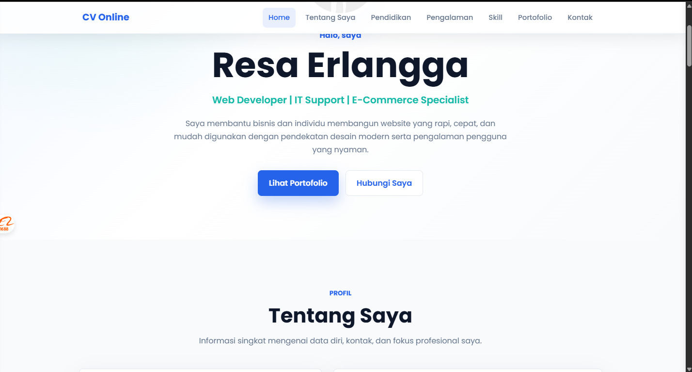

# 💼 Personal Portfolio / CV Website

Website CV online modern yang dibuat menggunakan **HTML5, CSS3, dan JavaScript murni** tanpa framework. Website ini dirancang responsif, ringan, dan mudah dikembangkan sebagai portofolio pribadi.

## 🌐 Demo

> GitHub Pages:
> https://kingdhet12.github.io/


---

## 📸 Preview

```md

```

---

# ✨ Fitur

- Responsive Desktop & Mobile
- Modern UI Design
- Smooth Scrolling
- Sticky Navigation
- Active Navigation Menu
- Fade-in Animation
- Hover Animation
- Back To Top Button
- Timeline Pendidikan
- Card Pengalaman Kerja
- Progress Bar Skill
- Portfolio Gallery
- Contact Form
- Google Font (Poppins)
- Font Awesome Icons

---

# 📂 Struktur Project

```
CV-Website
│
├── index.html
├── style.css
├── script.js
├── README.md
│
└── assets
    ├── profile.jpg
    ├── preview.png
    ├── portfolio1.jpg
    ├── portfolio2.jpg
    ├── portfolio3.jpg
    ├── portfolio4.jpg
    ├── portfolio5.jpg
    └── portfolio6.jpg
```

---

# 🛠️ Teknologi

- HTML5
- CSS3
- JavaScript (Vanilla JS)
- Google Fonts
- Font Awesome

---

# 📋 Halaman Website

## 🏠 Home

Menampilkan foto profil, nama, jabatan, dan deskripsi singkat.

---

## 👨 Tentang Saya

Informasi pribadi:

- Nama
- Tempat & Tanggal Lahir
- Alamat
- Email
- Nomor HP
- LinkedIn
- GitHub
- Deskripsi Singkat

---

## 🎓 Pendidikan

Ditampilkan menggunakan Timeline.

---

## 💼 Pengalaman Kerja

Ditampilkan dalam bentuk Card.

---

## 🚀 Skill

Progress Bar untuk:

- HTML
- CSS
- JavaScript
- PHP
- Laravel
- MySQL
- Photoshop
- Microsoft Office

---

## 📁 Portofolio

Minimal 6 Project.

Setiap project memiliki:

- Gambar
- Nama Project
- Deskripsi
- Tombol Detail

---

## 📞 Kontak

Berisi:

- Nama
- Email
- Pesan

---

# 🚀 Cara Menjalankan

1. Clone repository

```bash
git clone https://github.com/username/repository.git
```

2. Masuk ke folder project

```bash
cd repository
```

3. Jalankan website

Cukup buka file

```
index.html
```

menggunakan browser.

Tidak memerlukan instalasi atau server.

---

# 📱 Responsive

Website telah dioptimalkan untuk:

- Desktop
- Laptop
- Tablet
- Smartphone

---

# 📌 Pengembangan Selanjutnya

Beberapa fitur yang dapat ditambahkan:

- Dark Mode
- Multi Language
- Download CV PDF
- Blog
- Project Detail Page
- Animasi AOS
- EmailJS Contact Form
- Integrasi WhatsApp
- Statistik Pengunjung

---

# 📄 Lisensi

Project ini dibuat untuk keperluan pembelajaran dan portofolio pribadi.

Silakan digunakan, dimodifikasi, dan dikembangkan sesuai kebutuhan.

---

# 👤 Author

**Resa Erlangga**

📧 Email : your@email.com

🌐 Website : https://kingdhet12.github.io/

💼 LinkedIn : www.linkedin.com/in/resa-erlangga-42018b179

🐙 GitHub : https://github.com/kingdhet12

---

⭐ Jika project ini bermanfaat, jangan lupa berikan **Star** pada repository ini.
